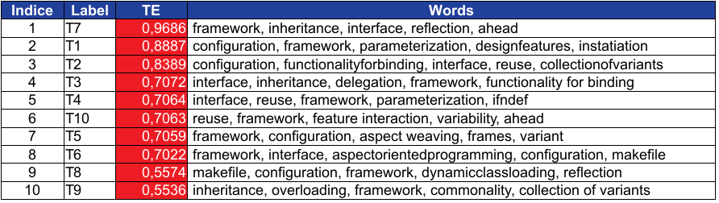

# Variability Implementation at Stack Overflow: An Empirical Study

This web page presents the supplementary material of the paper *Variability Implementation at Stack Overflow: An Empirical Study*.

## Abstract

An empirical investigation aiming at understanding how the theme "variability implementation" is discussed by the community of Information Technology professionals who use the Stack Overflow site is presented. A list of 52 words related to this theme was defined based on the literature of the area and the opinion of experts. They were then used as the initial vocabulary for the algorithm that implements the Latent Dirichlet Allocation (LDA) to find the main topics related to variability implementation, as well as to validate the words in the list.   The most used words have been used to select questions containing them. These questions have been inspect manually and in the end 1962 were accepted. These 1962 questions were then analyzed with the objective of discover the mechanisms of variability implementation more discussed, less discussed and not discussed; what is the delay in responding to the formal questions on variability implementation and how long the discussions last; and finally, what is the profile of Stack Overflow users who asked and answered the questions retrieved, as well as the degree of confidence one can have about the quality of the questions and answers presented. 

## Keyword
Variability implementation, Reuse, Stack Overflow, Software Product Line, Latent Dirichlet Allocation.

## Authors
Marco A. Paranhos Silva, Jonatas Ferreira Bastos, Paulo Anselmo da Mota Silveira Neto, Paulo Cesar Masiero, Eduardo Santana de Almeida

## Research Design

* Diagrama-1, methodology used to respond to RQ1 and RQ2

* Diagrama-2, methodology used to respond to RQ3 to RQ7

## Reseach Questions

In this paper we answer the following research questions:

* RQ1: What are the hot-topics that describe the answered questions related to variability implementation mechanisms in Stack Overflow?
* RQ2: What are the hot-topics that describe the unanswered questions related to variability implementation mechanisms in Stack Overflow?*
* RQ3: Do mechanisms of variability exist that are  discussed by the Stack overflow community?
* RQ4: What are the techniques related to variability implementation mechanisms most discussed in Stack overflow?
* RQ5: What are the mechanisms of variability implementation not discussed by the Stack overflow community?
* RQ6: How fast is the crowd at covering widely variability implementation mechanisms?
* RQ7: Can we rely on the stack overflow crowd?

To answer RQ1 and 2 we use [On-line LDA programs](online_lda_python-master.zip), and the following list of words as initial dictionary

| List of 52 initial Words | 
:------------: |
|aggregation, ahead, aspectorientedprogramming, aspectweaving, variant| 
|bindingtime, collectionofvariants, commonality, composition, conditionalcompilation| 
|conditiononconstant, conditiononvariable, configuration, constraintprogramming, decisionmodel| 
|delegation, derivation, designfeatures, dynamicclassloading, dynamiclinklibraries| 
|dynamicvariability, featuredependencies, featureide, featureinteraction, featuremodel|
|featuremodeling, foda, fop, frames, framework| 
|functionalityforbinding, ifdef, ifndef, inheritance, instatiation|
|interface, makefile, modularfeature, operationaldependencies, overloading| 
|parameterization, productfamily, productline, reflection, reuse| 
|staticlibraries, variability, variabilityinspace, variabilitymanagement, variabilityscope|  
|variantfeature, variationpoint|

The results of LDA for RQ 1 and 2 can be seen in the Tables: 

* Table - RQ1

* Table - RQ2

To answer RQ3 we combine the words according to the Table below, resulting in the [Result.xml](result.xml) file containing the questions retrieved

| Word     |  Combination |
:------------: | :------------ |
|“commonality”   |“variant”     |                    
|“commonality”   |“variant”     |                      
|“commonality”    |“aggregation”      |              
|“commonality”     |“parameterization”      |     
|“commonality”    |“reflection”             |          
|“commonality”    |“decision model”        |      
|“commonality”     |“feature interaction”     |   
|“commonality”    |“feature dependencies”     |
|“commonality”   |“feature model”      |          
|“commonality”   |“product line”    |               
|“commonality”   |“product family”     |          
|“commonality”  |“variation point”     |           
|“commonality”   |“conditional compilation”  |
|“commonality”    |“design pattern” |               
|“commonality”    |“ifdef”  |                              
|“commonality”     |“ifndef”       |
|   |   |
|“variability”    |“aggregation”      |              
|“variability”     |“parameterization”      |     
|“variability”    |“reflection”             |          
|“variability”    |“decision model”        |      
|“variability”     |“feature interaction”     |   
|“variability”    |“feature dependencies”     |
|“variability”   |“feature model”      |          
|“variability”   |“product line”    |               
|“variability”   |“product family”     |          
|“variability”  |“variation point”     |           
|“variability”   |“conditional compilation”  |
|“variability”    |“design pattern” |               
|“variability”    |“ifdef”  |                              
|“variability”     |“ifndef”       |
|   |   |
|“variability”   |“variant”     |                      
|“variability”    |“aggregation”      |              
|“variability”     |“parameterization”      |     
|“variability”    |“reflection”             |          
|“variability”    |“decision model”        |      
|“variability”     |“feature interaction”     |   
|“variability”    |“feature dependencies”     |
|“variability”   |“feature model”      |          
|“variability”   |“product line”    |               
|“variability”   |“product family”     |          
|“variability”  |“variation point”     |           
|“variability”   |“conditional compilation”  |
|“variability”    |“design pattern” |               
|“variability”    |“ifdef”  |                              
|“variability”     |“ifndef”       |                      
|   |   |
|“variant”    |“aggregation”   |                 
|“variant”   |“delegation”    |                   
|“variant”     |“parameterization” |           
|“variant”    |“reflection”      |              
|“variant”   |“decision model”       |        
|“variant”     |“feature interaction”     |   
|“variant”    |“feature dependencies”     |
|“variant”   |“feature model”      |            
|“variant”   |“product line”      |               
|“variant”   |“product family”   |              
|“variant”  |“variation point”  |                
|“variant”   |“conditional compilation”  |
|“variant”    |“design pattern”      |          
|“variant”    |“ifdef”       |                        
|“variant”     |“ifndef”         |                     
|   |   |
|“aggregation”   |“delegation”     |                  
|“aggregation”     |“parameterization”|            
|“aggregation”    |“reflection”          |             
|“aggregation t”   |“decision model”       |         
|“aggregation”     |“feature interaction”   |        
|“aggregation”    |“feature dependencies” |       
|“aggregation”   |“feature model”    |                
|“aggregation”   |“product line”      |                 
|“aggregation”   |“product family”    |              
|“aggregation”  |“variation point”      |             
|“aggregation”   |“conditional compilation” |   
|“aggregation”    |“design pattern” |                
|“aggregation”    |“ifdef”      |                           
|“aggregation”     |“ifndef”      |                        
|   |   |
|“delegation”     |“parameterization”    |         
|“delegation”    |“reflection”           |             
|“delegation”   |“decision model”         |         
|“delegation”     |“feature interaction”   |        
|“delegation”    |“feature dependencies”  |      
|“delegation”   |“feature model”      |               
|“delegation”   |“product line”     |                   
|“delegation”   |“product family”    |              
|“delegation”  |“variation point”      |             
|“delegation”   |“conditional compilation”     |
|“delegation”    |“design pattern”     |           
|“delegation”    |“ifdef”  |                               
|“delegation”     |“ifndef”     |                         
|    |  |
|“parameterization”    |“reflection”      |                  
|“parameterization”   |“decision model”           |      
|“parameterization”     |“feature interaction”   |        
|“parameterization”    |“feature dependencies” |       
|“parameterization”   |“feature model”       |              
|“parameterization”   |“product line”       |                
|“parameterization”   |“product family”     |               
|“parameterization”  |“variation point”     |                
|“parameterization”   |“conditional compilation” |    
|“parameterization”    |“design pattern”     |              
|“parameterization”    |“ifdef”     |                             
|“parameterization”     |“ifndef”     |                          
|   |   |
"reflection”   |“decision model”         |         
|“reflection”     |“feature interaction”       |    
|“reflection”    |“feature dependencies”       | 
|“reflection”   |“feature model”          |           
|“reflection”   |“product line”        |                
|“reflection”   |“product family”        |            
|“reflection”  |“variation point”        |             
|“reflection”   |“conditional compilation” |    
|“reflection”    |“design pattern”   |                
|“reflection”    |“ifdef”       |                           
|“reflection”     |“ifndef”         |                      
|   |   |
|“decision model”     |“feature interaction”   |        
|“decision model”    |“feature dependencies”     |   
|“decision model”   |“feature model”          |           
|“decision model”   |“product line”      |                  
|“decision model”   |“product family”         |           
|“decision model”  |“variation point”              |       
|“decision model”   |“conditional compilation”      |
|“decision model”    |“design pattern”    |               
|“decision model”    |“ifdef”     |                             
|“decision model”     |“ifndef”     |                         
|   |   |
|“feature dependencies”   |“feature model”      |               
|“feature dependencies”   |“product line”       |                 
|“feature dependencies”   |“product family”      |              
|“feature dependencies”  |“variation point”        |             
|“feature dependencies”   |“conditional compilation” |    
|“feature dependencies”    |“design pattern”       |            
|“feature dependencies”    |“ifdef”              |                    
|“feature dependencies”     |“ifndef”            |                   
|    |   |
|“feature model”   |“product line”  |                      
|“feature model”   |“product family” |                   
|“feature model”  |“variation point”    |                 
|“feature model”   |“conditional compilation” |    
|“feature model”    |“design pattern”    |               
|“feature model”    |“ifdef”   |                               
|“feature model”     |“ifndef”  |                             
|   |   |
|“product line”   |“product family”  |                    
|“product line”  |“variation point”       |                
|“product line”   |“conditional compilation”    |   
|“product line”    |“design pattern”         |            
|“product line”    |“ifdef”               |                     
|“product line ”     |“ifndef”            |                     
|   |   |
|“product family”  |“variation point”   |                    
|“product family”   |“conditional compilation”  |     
|“product family”    |“design pattern”         |            
|“product family”    |“ifdef”              |                     
|“product family”     |“ifndef”            |                     
|  |   |
|“variation point”   |“conditional compilation”       |
|“variation point”    |“design pattern”        |             
|“variation point”    |“ifdef”    |                            
|“variation point”   |“conditional compilation” |
|   |   |
|“conditional compilation”    |“design pattern”      |              
|“conditional compilation”    |“ifdef”     |                               
|“conditional compilation”     |“ifndef”  |                               
|     |    |      
|“design pattern”    |“ifdef”  |                                 
|“design pattern”     |“ifndef”  |                              
|    |   |
|“ifdef”     |“ifndef”|                                

## References

M. D. Hoffman, D. M. Blei, F. Bach, Online learning for latent dirichlet allocation, NIPS’10, 2010, pp. 856–864.

L. Mamykina, B. Manoim, M. Mittal, G. Hripcsak, B. Hartmann, Design lessons from the fastest q&a; a site in the west, ACM, 2011, pp. 2857–2866.

C. Parnin, C. Treude, L. Grammel, Crowd documentation: Exploring the coverage and the dynamics of API discussions on
stack overflow, Georgia Institute of Technology Technical Report GIT-CS-12-05 (2012).

M. Linares-Vásquez, B. Dit, D. Poshyvanyk, An exploratory analysis of mobile development issues using stack overflow, 2013, pp. 93–96.

C. Chen, Z. Xing, Mining technology landscape from stack overflow, ESEM ’16, 2016, pp. 14:1–14:10.
