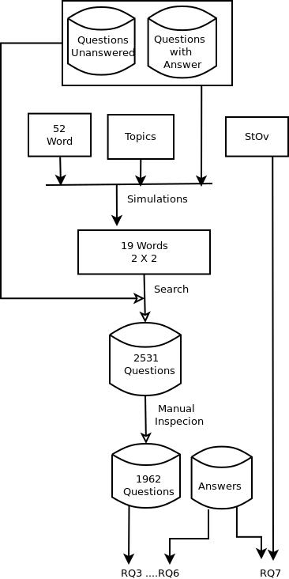

# Variability Implementation at Stack Overflow: An Empirical Study

This web page presents the supplementary material of the paper *Variability Implementation at Stack Overflow: An Empirical Study*.

## Abstract

An empirical investigation aiming at understanding how the theme "variability implementation" is discussed by the community of Information Technology professionals who use the Stack Overflow site is presented. A list of 52 words related to this theme was defined based on the literature of the area and the opinion of experts. They were then used as the initial vocabulary for the algorithm that implements the Latent Dirichlet Allocation (LDA) to find the main topics related to variability implementation, as well as to validate the words in the list.   The most used words have been used to select questions containing them. These questions have been inspect manually and in the end 1962 were accepted. These 1962 questions were then analyzed with the objective of discover the mechanisms of variability implementation more discussed, less discussed and not discussed; what is the delay in responding to the formal questions on variability implementation and how long the discussions last; and finally, what is the profile of Stack Overflow users who asked and answered the questions retrieved, as well as the degree of confidence one can have about the quality of the questions and answers presented. 

## Keyword
Variability implementation, Reuse, Stack Overflow, Software Product Line, Latent Dirichlet Allocation.

## Authors
Marco A. Paranhos Silva, Jonatas Ferreira Bastos, Paulo Anselmo da Mota Silveira Neto, Paulo Cesar Masiero, Eduardo Santana de Almeida

## Research Design

* Diagrama-1, methodology used to respond to RQ1 and RQ2

* Diagrama-2, methodology used to respond to RQ3 to RQ7

## Reseach Questions

#### RQ1: What are the hot-topics that describe the answered questions related to variability implementation mechanisms in Stack Overflow?

* Table LDA RQ1,

#### RQ2: What are the hot-topics that describe the unanswered questions related to variability implementation mechanisms in Stack Overflow?*

* Table LDA RQ2,

#### RQ3: Do mechanisms of variability exist that are  discussed by the Stack overflow community?

#### RQ4: What are the techniques related to variability implementation mechanisms most discussed in Stack overflow?

#### RQ5: What are the mechanisms of variability implementation not discussed by the Stack overflow community?

#### RQ6: How fast is the crowd at covering widely variability implementation mechanisms?

#### RQ7: Can we rely on the stack overflow crowd?

## The main contributions and results of this research are as follows:

   * Definition of a list of words that refer to variability implementation concepts and techniques that are most commonly used by the Stack Overflow developer community.
   * item Several research results (or findings) on the set of questions -- and answers -- selected, among which we highlight the following:
  * Two groups of words were identified as those most used by the Stack Overflow community: one more conceptual and one more related to variability implementation techniques.
  * The average delay time for the first answer to the questions and the duration of the discussion when there is more than one answer.
  * The study on the degree of confidence in the Stack Overflow user group that asked questions or answered questions based on the reputation indicator of community members.

## Future works

New research works can be carried out in the future to continue this work and explore some points raised here but not deepened. One of them would be to use the list of words most used by the community of StOv on variability implementation as the basis for other studies, using other forums or even to guide discussions about the subject.

Another interesting research would be to make an analysis of the selected questions and answers related to the variability implementation for feeling detection in software engineering.

The third proposal of new studies would be to carry out a study to identify  specialists in software reusability among the users of StOv. In addition, a more qualitative exploratory study could be carried out with the specialists found to confirm the results found or to seek other information about this community and how it deals with reuse of software and, more specifically, with the variability implementation.

## References

M. D. Hoffman, D. M. Blei, F. Bach, Online learning for latent dirichlet allocation, NIPS’10, 2010, pp. 856–864.

L. Mamykina, B. Manoim, M. Mittal, G. Hripcsak, B. Hartmann, Design lessons from the fastest q&a; a site in the west, ACM, 2011, pp. 2857–2866.

C. Parnin, C. Treude, L. Grammel, Crowd documentation: Exploring the coverage and the dynamics of API discussions on
stack overflow, Georgia Institute of Technology Technical Report GIT-CS-12-05 (2012).

M. Linares-Vásquez, B. Dit, D. Poshyvanyk, An exploratory analysis of mobile development issues using stack overflow, 2013, pp. 93–96.

C. Chen, Z. Xing, Mining technology landscape from stack overflow, ESEM ’16, 2016, pp. 14:1–14:10.
